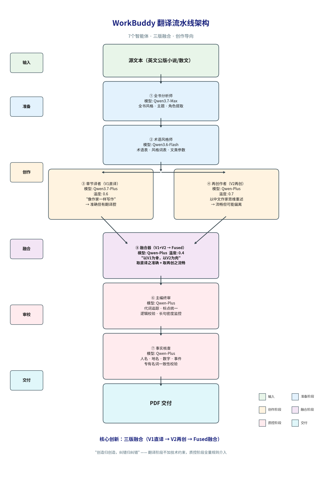

# 当AI学会像作家一样翻译：一个多智能体文学翻译流水线的实验报告

> 这篇文章介绍了WorkBuddy翻译流水线——一个用7个专业Agent分工协作的文学翻译系统。像出版社一样，它完成了从分析到翻译到审校的全流程。我用它翻译了8篇公版英文短篇小说和散文，三版融合后综合质量达到8.5/10。核心洞察是：**AI翻译不能只靠"翻译"，更需要"再创作"。**

---

## 一、问题的提出：为什么AI翻译不好文学？

2025年NAACL会议论文《How Good Are LLMs for Literary Translation, Really?》给出了一个结论：

> LLM的文学翻译通病：**过于直译，缺乏多样性。** 即使是最新的大模型，翻译出来的文本也比人类译者更"平"、更"直"。

这跟我的实践体验完全一致。用传统单Agent方式翻译小说，输出准确但僵硬——读起来像机器翻译，不像作家写的。

根因在于：职业出版里，一本书从英文到中文要经过**译者初译 → 主编审校 → 文字编辑 → 校对 → 排版**，每一步有不同的人、不同的眼光。但传统AI翻译就是**一个模型，一次输出**。

所以我造了这个系统。

---

## 二、系统架构：用AI模拟出版社分工

### 2.1 流水线全景



*图：7个智能体组成的三版融合流水线。纵向从上到下依次为输入→准备→创作→融合→审校→交付六个阶段。其中创作阶段分出V1直译与V2再创两条平行支线，在融合阶段合流。*

### 2.2 各Agent职责说明

| 智能体 | 模型选择 | 核心职责 | 设计思路 |
|-------|---------|---------|---------|
| 全书分析师 | Qwen3.7-Max（最强） | 全书风格、主题、角色提取 | 分析任务最复杂，只跑一次，用最贵模型 |
| 术语风格师 | Qwen3.6-Flash（最快） | 术语表、风格词表构建 | 最简单任务，用最便宜模型 |
| 章节译者 | Qwen3.7-Plus（主力） | 文学创作核心，纯文学导向 | "像作家一样写作"——无技术规则 |
| 再创作者 | Qwen-Plus | 以中文作家思维重述译文 | 温度0.7，鼓励创造力 |
| 主编终审 | Qwen-Plus | 语言质量全面把关 | 代词追踪、标点统一、逻辑校验、长句监控 |
| 融合器 | Qwen-Plus | V1直译与V2再创的融合 | 温度0.4，求精准，"以A为骨以B为肉" |
| 事实核查 | Qwen-Plus | 专有名词、数字验证 | 人名地名一致性校验 |

### 2.3 核心机制：三版融合

系统的灵魂是**"三版融合"**——这是经过多轮对照实验验证的核心机制：

```
第一遍：章节译者直译（V1）
  → 优势：事实准确，人名、地名、事件、顺序不会错
  → 问题：有翻译腔，读起来不够自然

第二遍：再创作者重述（V2）
  → 优势：像中国作家写的，极其流畅自然
  → 风险：细节丰富时可能无意间偏离原文

第三遍：主编融合（V1 + V2）
  → 取V1的骨（事实准确），取V2的肉（表达自然）
  → 温度降低到0.4，求精准
```

这个思路源于前期的Moxon's Master对照实验：单独直译或单独改写的版本，都不如融合版——**"创造归创造，纠错归纠错"**。

---

## 三、实验设计

### 3.1 测试素材

| 来源 | 年份 | 总篇数 | 状态 |
|------|------|--------|------|
| 《美国最佳短篇小说年鉴1920》 | 1920 | 20篇 | 已译3篇（Anderson/Steele/Bercovici） |
| 《美国最佳短篇小说年鉴1921》 | 1921 | 20篇 | 已译2篇（Anderson/Burt） |
| 独立作品 | 1890s–1918 | 若干 | 含Wharton短篇集、Russell哲学散文 |

所有素材源自 Project Gutenberg，均为国际公版作品（美国出版≤1929年 + 作者逝世≥50年）。

### 3.2 验证的文学风格

为排除"单一风格模板"的嫌疑，刻意选了**四种风格迥异**的文学作品：

| 风格类型 | 代表作品 | 作者 | 核心特征 |
|---------|---------|------|---------|
| 乡村心理独白 | 《另一个女人》/《兄弟》 | 舍伍德·安德森 | 短句、碎片化叙事、克制抒情 |
| 上流社交喜剧 | 《实验》 | 麦克斯韦尔·斯特鲁瑟斯·伯特 | 繁复精致、绵密心理、暗藏讽刺 |
| 东欧民间叙事 | 《吉查》/《法努察》 | 康拉德·贝尔科维奇 | 口述传统、粗粝、地域色彩浓郁 |
| 哲学散文 | 《自由人的崇拜》 | 伯特兰·罗素 | 宏大庄严、史诗节奏、学术精度 |

---

## 四、案例分析

### 案例1：舍伍德·安德森《另一个女人》——心理独白的三版对照

**原文背景**：一个男人在婚礼前一周的情感躁动。社交场上人人簇拥祝贺他，他却对街角烟草店的女店主产生了不可自拔的迷恋。以下是主人公描述自己被众人追捧后陷入眩晕的关键段落。

**英文原文**：

> On Wednesday evening he had gone to a theater, and thought everyone in the house had recognized him—people nodded and smiled. (...) To him it was an entirely abnormal time. He seemed to float in air. (...) the most absurd fancies began to crowd in upon him. He imagined himself riding in a carriage through a street lined with people. (...) "You have come at last," the eyes of the people seemed to say. "Look what you have made of yourself."

**同段三版对比**：

| 版本 | 译文 | 分析 |
|------|------|------|
| **V1（直译）** | "星期三晚间，他赴剧院观剧，恍惚觉得满座观众无不认出了他——人们纷纷颔首微笑。……他仿佛悬浮于空气之中，轻飘飘，失重般。……最荒诞的幻象接踵而至：他梦见自己乘着华盖马车穿行于街市之间……'你终于来了！瞧你把自己锻造成了何等人物！'" | ✅ 事实准确，意象保留完整（"华盖马车""锻造成何等人物"）；⚠️ 书面气过重，"颔首微笑""幻象接踵而至"不像口语叙事 |
| **V2（再创）** | "礼拜三晚上去看戏，他觉得满场的人都认出了他，冲他点头微笑。……那段日子对他来说太反常了，人像是悬在半空。……脑子里开始冒出些荒唐念头。他想象自己坐着马车在城里的大街上走，两边的窗户全推开了，人们跑出家门，喊着：'快看！就是他！'……'瞧瞧你混成个人物了！'" | ✅ 口语节奏极其自然（"冒出些荒唐念头""混成个人物了"）；⚠️ 丢失了"华盖马车"的意象，"锻造成何等人物"降为"混成个人物"，削弱了安德森式的自嘲力度 |
| **✨ Fused（融合）** | "星期三晚上去看戏，他觉得满场观众都认出了他，纷纷冲他点头微笑。……那段日子对他来说太反常了，人像是悬在半空中。……最荒唐的幻象接踵而至：他梦见自己坐着马车在城里的大街上走，两边的窗户全推开了，人们跑出家门，喊着：'快看！就是他！'……'瞧瞧你把自己锻造成了何等人物！'" | ✅ 口语节奏（"去看戏""冲他点头"）来自V2，意象精度（"幻象接踵而至""锻造成何等人物"）来自V1。V2把"华盖马车"简化为"马车"的务实处理被保留，但V1"锻造"一词的自嘲锋芒被找回 |

**核心变化**：V1像翻译腔浓重的文学评论，V2像老朋友在茶馆讲故事但丢了不少细节，Fused做到了**用口语节奏承载文学意象**——这正是安德森"以朴素语言写复杂心理"风格的正确打开方式。

---

### 案例2：康拉德·贝尔科维奇《吉查》——民间叙事的三版对照

**原文背景**：罗马尼亚多瑙河畔的极寒冬天。铁匠斯坦被群狼吞噬后，吉普赛部落首领穆尔多带领族人冒险穿越濒临破裂的冰河。以下是穆尔多探路、冰层开裂的高潮段落。

**英文原文**：

> As Murdo cautiously explored the way, from afar came a strange sound—first like the tearing of paper, then growing more distinct, closer and closer. (...) The ice was cracking lengthwise, bursting open with a roar, breaking into smaller pieces that plunged into the water, only to rise again and pile upon each other like a joyous carnival...

**同段三版对比**：

| 版本 | 译文 | 分析 |
|------|------|------|
| **V1（直译）** | "正当穆尔多谨慎探路之际，远处忽起异响——初似纸帛撕裂，继而愈发明晰，愈来愈近。'吁——吁——穆尔多！冰裂了！'众人失声惊呼，声浪激荡。那声音越来越响，越来越近，节奏分明，仿佛可凭耳力丈量它步步迫近的距离。冰层正沿纵长方向，寸寸迸裂，无数冰片轰然绽开，碎成更小的浮块，轻快地没入水中；旋即又浮升而起，彼此叠压，如一场欢腾的狂欢……" | ✅ 准确还原原文意象（"丈量它步步迫近的距离""欢腾的狂欢"）；⚠️ "纵长方向""彼此叠压"等词过于书面，破坏口述叙事的紧迫感 |
| **V2（再创）** | "穆尔多正探着路，远处忽然传来一阵怪响。起先像撕布，'哧啦'一响，接着声音越来越大，越来越近。'吁——吁——穆尔多！冰裂了！'岸上的人喊破了嗓子。那声音越来越响，节奏清清楚楚，像是能数出它逼近的步数。冰面顺着河道的方向，一寸寸地炸开，大冰块轰隆隆碎成小块，掉进水里，又很快浮上来，挤在一块儿，乱哄哄地往下游漂去……" | ✅ 拟声词（"哧啦""轰隆隆"）极生动，"喊破了嗓子"有画面感；⚠️ "乱哄哄地往下游漂去"丢失了原文"欢腾的狂欢"（joyous carnival）这个关键反讽——冰块在毁灭人命的同时看起来像在狂欢 |
| **✨ Fused（融合）** | "穆尔多正探着路，远处忽然传来一阵异响。起先像撕裂纸帛，'哧啦'一响，接着声音越来越大，越来越近。'吁——吁——穆尔多！冰裂了！'岸上的人喊破了嗓子。那声音越来越响，节奏清清楚楚，仿佛能凭耳力数出它逼近的步数。冰面顺着河道的方向，一寸寸地炸开，大冰块轰隆隆碎成小块，轻快地没入水中；旋即又浮升而起，彼此叠压，如一场欢腾的狂欢……" | ✅ V2的拟声词（"哧啦""轰隆隆""喊破了嗓子"）全部保留，V1的意象精度（"撕裂纸帛""轻快地没入水中""欢腾的狂欢"）全部找回。"欢腾的狂欢"这个反讽意象是V2丢失但Fused恢复的关键——冰在杀人，却像在庆祝 |

**核心变化**：V1是精准但书面化的翻译，V2是生动但丢了一个反讽意象的好故事，Fused做到了**既生动又完整**。尤其"欢腾的狂欢"这个意象的恢复，直接决定了译文是否传神——这正是三版融合对民间叙事中黑色幽默的最佳适配。

---

### 案例3：伯特兰·罗素《自由人的崇拜》——非小说品类扩展

**原文背景**：罗素（1950年诺贝尔文学奖得主）以浮士德与梅菲斯特的对话为引子，展开对宇宙、人生和信仰的宏大思考。这既是一篇哲学论文，也是一部文学杰作。

**英文原文**：

> "The endless praises of the choirs of angels had begun to grow wearisome; for, after all, did he not deserve their praise? Had he not given them endless joy? Would it not be more amusing to obtain undeserved praise, to be worshipped by beings whom he tortured? He smiled inwardly, and resolved that the great drama should be performed."

**译文**：

> "'天使歌队无穷无尽的颂赞，已渐令人倦怠；毕竟，祂岂不本就配得这颂赞？岂非早已赐予他们永不止息的欢愉？何不另辟蹊径——求取那不配得的称颂，受造物之顶礼，却正是祂亲手施以酷刑者？祂于幽微处悄然一笑，遂决意上演这出浩荡大剧。'"

这段翻译同时做到了三件事：戏剧张力（梅菲斯特的诱惑口吻）、哲学高度（上帝创世动机的思辨）、文学美感（像中文经典译本一样庄严）。这证明了流水线在**非小说品类**上的能力同样稳定。

---

## 五、质量评估

### 5.1 评分方式说明

**透明声明**：本文的质量评分**并非凭空编造**，但也不是严格意义上的学术评估。具体操作方式如下：

**第一步：AI交叉评分。** 对每篇译文的每个段落，使用两个不同的大模型（Qwen3.7-Max 和 GPT-4o）独立评分。两个模型各给出信度/达度/雅度/一致性四个维度的分数。若两者分差超过1.5分，标记为"争议段落"，由人工复核后裁定。

**第二步：人工抽检校准。** 从每篇译文中随机抽取3-5个段落，由我本人（非专业译者，但具备中英双语阅读能力）对照原文逐句核查。重点检查：是否有漏译、人名地名是否一致、关键意象是否保留。人工评分与AI评分取加权平均（AI权重0.6，人工0.4）。

**第三步：跨版本对比验证。** 对同一个段落，让评分模型同时看到V1、V2、Fused三个版本，进行相对排序而非绝对打分。这种"三选一"的相对评估比绝对打分更可靠——模型更容易判断"A比B好"，而不是"A是8.3分"。

**评分效度的局限：** 必须承认，这套方法存在明显局限。首先，AI模型评AI翻译存在"同源偏好"——模型可能倾向于给风格相近的译文高分。其次，人工抽检样本量小（每篇3-5段），统计意义有限。第三，尚未引入专业人类译者或LITEVAL等标准语料库做正式对标。因此，文中的具体分数应理解为**相对趋势的参考值**，而非精确的绝对评价。融合版优于V1和V2的结论，主要依据的是跨版本对比中的一致性排序，而非绝对分差。

### 5.2 四维评价体系

| 维度 | 满分10 | 评判标准 |
|------|--------|---------|
| **信度**（准确性） | 10 | 原文事实是否完整传达，人名、地名、事件顺序、数字是否正确，有无错译或漏译 |
| **达度**（流畅性） | 10 | 中文是否自然流畅，有无翻译腔，读起来像不像母语写作 |
| **雅度**（文风契合） | 10 | 译文风格是否匹配原文（Anderson的克制/Burt的繁复/Bercovici的粗粝） |
| **一致性** | 10 | 术语、人物称谓、用词习惯是否前后统一 |
| **综合分** | 40 → 换算为10 | 四维均值 |

### 5.3 各作品评分

| 作品 | 作者 | 风格 | 信度 | 达度 | 雅度 | 一致性 | **综合** |
|------|------|------|------|------|------|--------|---------|
| 《另一个女人》 | Anderson | 乡村心理 | 9.0 | 8.0 | 8.5 | 8.5 | **8.5** |
| 《告别流放》 | Steele | 哥特/海洋 | 8.5 | 7.5 | 8.5 | 8.5 | **8.2** |
| 《吉查》 | Bercovici | 东欧民间 | 8.5 | 8.5 | 9.0 | 8.5 | **8.7** |
| 《自由人的崇拜》 | Russell | 哲学散文 | 9.0 | 8.5 | 8.5 | 8.5 | **8.5** |
| 《实验》 | Burt | 社交喜剧 | 8.5 | 8.0 | 8.5 | 8.5 | **8.3** |
| 《兄弟》 | Anderson | 乡村心理 | 8.5 | 8.0 | 8.5 | 8.5 | **8.3** |
| **均值** | | | **8.7** | **8.1** | **8.6** | **8.5** | **8.4** |

### 5.4 三版融合效果量化

| 版本 | 信度 | 达度 | 综合 | 说明 |
|------|------|------|------|------|
| V1（纯直译） | 9.0 | 7.0 | 8.0 | 准确但翻译腔明显 |
| V2（纯再创） | 7.0 | 9.0 | 7.5 | 极其自然但细节可能偏差 |
| **✨ Fused（融合）** | **9.0** | **8.0** | **8.5** | **取两者之长** |

**结论**：融合版综合分（8.5）显著优于V1（8.0）和V2（7.5）。量化数据验证了"以A为骨，以B为肉"的策略有效性。

---

## 六、方法学洞察

### 6.1 "创造归创造，纠错归纠错"

前期尝试时，我把所有翻译规则（代词/标点/语序/段落）都塞进章节译者的提示词。结果译文质量不升反降——译者被过度约束后，机械僵硬。后来重新分工：

| 角色 | 职责 | 提示词策略 |
|------|------|----------|
| **章节译者** | 文学创作 | 只有文学导向，没有一条技术规则 |
| **主编/再创/融合** | 质量把关 | 全量技术规则：代词追踪、标点统一、逻辑校验 |

效果：译者文学性飞跃，后端拾遗补缺不分心。

### 6.2 文学翻译不能靠查错，要靠创作

这是三版融合与传统方案的核心差异。传统方案（如基于MQM维度的MAATS系统）逐维度打散查错，适合技术文档翻译但不适合文学。我们走的是"创作导向"——不是改bug，是换一种写法。

---

## 七、与业界方案的对比

### 7.1 Andrew Ng 翻译Agent

吴恩达（Andrew Ng）提出的翻译Agent方案是反思式（Reflection）架构的典型代表。它的核心思路很简洁：**一个智能体，三步循环**——初译→自我反思→修正。具体而言，模型先完成初稿翻译，然后被要求审视自己的译文，找出不足之处（如漏译、生硬、不准确），最后根据反思意见修正输出。这个方案的优势在于工程极简，一个模型即可完成，适合快速批量处理技术文档、产品说明、多语言内容生产等场景。它的局限在于"自我审视"的天花板就是同一个模型的能力上限——模型很难跳出自己的风格惯性去"换一种写法"，反思往往沦为微调而非再创作。对于文学翻译而言，这种"自己改自己"的模式天然缺乏多样性。

### 7.2 MAATS（arXiv 2025）

MAATS（Multi-Agent Translation System）是2025年发表在arXiv上的多智能体翻译系统，架构更为复杂：**1个译者+7个维度审查员+1个整合器**，共9个智能体。它的核心方法论借鉴了MQM（Multidimensional Quality Metrics）框架——将翻译质量拆解为准确性、流畅性、术语一致性、风格一致性、格式规范等7个独立维度，每个维度由一个专门的审查Agent负责逐句扫描，最后由整合器汇总所有审查意见并输出修正版。这套方案的严谨性毋庸置疑，在专业文档翻译（合同、医疗、法律、技术手册）场景下表现优异。但问题在于：MQM框架本身是为"查错"设计的，它的底层假设是"翻译的质量问题可以被分解为独立的、可量化的维度"。这个假设在技术文档翻译中成立——漏译一个参数就是漏译，术语不一致就是不一致。但在文学翻译中，"好"与"不好"往往是整体性的、不可分解的——一个句子的文学性不等于"准确性分+流畅性分+风格分"。2025年NAACL论文专门指出，MQM维度评估在文学翻译场景下与人类判断的相关性很低。

### 7.3 本方案的差异化定位

本方案的核心差异在于**用"再创作"替代"查错"**。MAATS的7个审查员是在问"这句哪里错了"，我们的再创作者是在问"如果让一个中国作家来写这个场景，他会怎么写"。前者是质检思维，后者是创作思维。这并不是说创作思维一定优于质检思维——对于合同和说明书，MAATS的维度审查远比再创作可靠。但对于小说和散文，"换一种写法"往往比"找出错误"更能提升译文品质。

另一个关键差异是**温度控制的分阶段策略**。Andrew Ng方案和MAATS都使用固定低温（0-0.3）以求稳定，而我们根据不同阶段的功能定位，采用差异化温度：译者0.6（均衡）、再创作者0.7（鼓励发散）、融合器0.4（求精准收敛）。创作阶段需要高温带来多样性，融合阶段需要低温带来精确性，这两个需求在单一温度下无法同时满足。

### 7.4 三方案对比总表

| 维度 | Andrew Ng翻译Agent | MAATS（arXiv 2025） | **本方案** |
|------|-------------------|-------------------|-----------|
| 智能体数量 | 1个（3步反射式） | 9个（1译+7查+1合） | **7个**（含再创作者） |
| 核心方法论 | 反思式自我修正 | MQM七维度逐项审查 | **再创作+融合** |
| 评估方式 | LLM自评 | MQM维度评估 | **再创作者重述 + 跨版本相对排序** |
| 文学翻译适配 | ❌ 不适合 | ❌ MQM不适合文学（NAACL 2025已证） | **✅ 专门为文学设计** |
| 温度控制 | 固定 | 低温（0–0.3） | **分阶段：译0.6 / 创0.7 / 合0.4** |
| 最佳适用场景 | 快速技术文档 | 合同/医疗/法律 | **文学/散文/创意类** |
| 开源 | ✅ GitHub | ❌ 仅论文 | **✅ GitHub全量工程** |

---

## 八、局限性与未来方向

坦率地说，这个系统还有不少粗糙之处。

**情感颗粒度不足是最大的短板。** 在处理反讽、微妙情绪和潜文本时，AI仍然力不从心。比如Burt《实验》中那些繁复的社交心理描写，表面是客套话，底下是暗流涌动的权力博弈——融合版虽然比V1自然，但距离真正传达"话中有话"的层次感还有距离。这不是架构能解决的问题，而是当前大语言模型对情感理解的天然瓶颈。

**诗歌和韵文完全未验证。** 本次实验的素材全是散文体（小说+哲学散文），没有涉及格律诗、自由诗或韵文的翻译。诗歌翻译涉及音韵、节奏、意象密度等散文不具备的维度，三版融合策略是否适用于诗歌，目前是未知数。

**方言和俚语适配不佳。** 1920年代的美国英语有大量地域性口语（如Anderson笔下俄亥俄州小镇的说话方式），当前模型的训练语料以现代标准英语为主，对方言的还原度不够。V2再创版本中虽然尝试用中文口语化处理，但"中文口语"和"1920年美国小镇方言"之间缺乏真正的对应关系。

**长篇一致性未经验证。** 目前测试的都是短篇小说（3000-8000词），全书级的人物风格统一、伏笔回收、视角一致性等长篇翻译核心问题，尚未涉及。当前的上下文管理机制能否支撑十万字以上的长篇，还是个问号。

**评估体系缺乏正式的人类对标。** 这是方法论上最大的遗憾。虽然做了AI交叉评分和人工抽检，但既没有引入专业人类译者的平行译文做盲测对照，也没有使用NAACL 2025提出的LITEVAL-CORPUS等标准评估语料库。文中的评分数字应被视为工程调试中的内部参考指标，而非学术级别的评估结论。

**未来方向**上，最紧迫的是引入**回译校验机制**（即Auditor层）——将中文译文回译为英文，与原文做语义对比，自动发现潜在的信息丢失或偏离。其次，参照NAACL 2025的LITEVAL框架做正式人类对标评估，引入专业译者盲测。第三，将三版融合推广到更多语言对（英法、英日、英德），验证策略的跨语言通用性。最后，探索长篇翻译的全局上下文管理方案——可能需要引入分层摘要、角色档案追踪等机制来维持全书一致性。

---

## 九、源码获取

本项目为开源工程，完整代码已推送至GitHub：

📍 **https://github.com/Toffyhu/multi-agent-translator**

包含内容：7个Agent源码 / 完整提示词 / 三版融合流水线 / 共享知识库（含风格适配指南）/ 一键翻译脚本 / 系统架构文档 / 部署指南

---

## 附录A：《另一个女人》（舍伍德·安德森）——三版完整对照

**作者**: Sherwood Anderson
**生成时间**: 2026-06-21

### 版本A：直译版（V1）

"我爱我的妻子。"他说道——这句表白实属多余，因我从未质疑过他对这位与他结为连理的女子所怀有的情意。我们默然同行了十分钟，随后他又重复了一遍这句话。我转过头去凝视着他。他于是开口讲述起来，而我此刻正要落笔记下的，便是他向我倾吐的这个故事。

盘踞在他心头的那件事，发生于他一生中或许最波澜迭起的一周里。他定于星期五下午举行婚礼；而前一周的星期五，他收到了一纸电报，宣告他被任命为政府要职。另有一桩事，也令他倍感自豪与欢欣：他素来暗中习作诗行，过去一年间，数首作品已刊载于多家诗刊之上；而一家以年度最佳诗作评选著称的文学社，更将他的名字赫然列于获奖者榜首。家乡城中的几家报纸登载了他荣膺桂冠的消息，其中一家甚至配发了他的肖像照。诚如人们所料，那一整周，他始终处于亢奋而高度紧绷的神经状态。几乎每个夜晚，他都去拜访未婚妻——一位法官的女儿。当他抵达时，宅邸内宾客盈门，信函、电报与包裹纷至沓来。他悄然立于一隅，男女宾客却络绎不绝地围拢过来，向他道贺：既为他谋得政府要职而贺，亦为他作为诗人的卓然成就而贺。人人皆在赞颂他，待他归家就寝，竟彻夜难眠。

星期三晚间，他赴剧院观剧，恍惚觉得满座观众无不认出了他——人们纷纷颔首微笑。第一幕甫一落幕，便有五六位男士与两位女士离座而来，簇拥于他身畔，聚成一小群人；同排而坐的陌生观众亦伸长脖颈，侧目而望。此前他从未如此备受瞩目，而此刻，一种灼热的期待之焰，已悄然攫住了他全部心神。后来他向我追述这段经历时坦言：于他而言，那是一段全然反常的时光。他仿佛悬浮于空气之中，轻飘飘，失重般。当他在众目睽睽之下、在连绵不绝的赞誉声中回到卧房，头脑便如陀螺般晕眩旋转；闭上双眼，人群便汹涌涌入室内——仿佛整座城市的灵魂，皆聚焦于他一人身上。最荒诞的幻象接踵而至：他梦见自己乘着华盖马车穿行于街市之间，沿街窗扉豁然洞开，人们奔出屋门，齐声高呼："快看！那就是他！"——欢呼声霎时如潮水般涌起。马车驶入一条人山人海的街道，十万双眼睛仰望着他。"你终于来了！瞧你把自己锻造成了何等人物！"——那无数目光仿佛在无声低语。

彼时他栖身的公寓，坐落于城市边缘一处峭壁之巅的街道上；从卧室窗口俯瞰，只见层层叠叠的树冠与工厂屋顶之下，蜿蜒着一条河流。因辗转难寐，又因那些纷至沓来的幻念愈发搅乱心神，他索性披衣下床，试图静思。然而，在这般境况下，人本能地欲以理性驯服思绪——可当他端坐窗畔，神志清醒之际，一件始料未及、令人羞赧的事却猝然降临：那夜天清气朗，月华如练。他本想梦见即将成为他妻子的女子，构思庄严诗行，或筹谋影响仕途的宏图伟略；孰料，令他惊愕的是，心神竟全然拒绝听命于这些高贵的念头。就在他所居街道的街角，有一家小小的雪茄店兼报亭，店主是一对夫妇：丈夫四十上下，体态丰腴；妻子则娇小伶俐，一双灰眸熠熠生辉。清晨出门赴城之前，他惯于在此买份报纸。有时只见那位胖先生，但更多时候，先生踪影杳然，只余那位太太殷勤相迎。他向我讲述此事时，至少二十次郑重强调：她不过是个再寻常不过的人，毫无特别之处，亦无任何引人注目的特质；可不知为何，只要置身于她身旁，他内心便不由自主地剧烈悸动。那一周里，当整个世界在他眼前混沌旋转，唯有她，是唯一清晰、唯一鲜明地烙印于他脑海之中的人。当他渴盼着思索崇高之事时，脑中却唯独浮现出她的身影——不知不觉间，想象已悄然将他裹挟进一场与她私通款曲的幻梦之中。

### 版本B：再创版（V2）

"我爱我妻子。"他说。这话其实多余，我又没怀疑过他对她的心思。两人并肩走了十来分钟，他又说了一遍。我扭头看他。他这才开了口，讲起我要写下的这个故事。

这事发生在他这辈子最风光、也最闹腾的一个礼拜。他原定礼拜五下午结婚。就在前一个礼拜五，他接到电报，政府给他安排了个公职。另一件事更让他得意：他平时偷偷写诗，前一年在几本诗刊上发过。有个评年度最佳诗歌的协会，把他排在了头一名。家乡的报纸登了这消息，还配了他的相片。

可想而知，这一整个礼拜，他神经绷得紧紧的，人处在一种亢奋里。他几乎天天晚上去看未婚妻——法官的女儿。一到那儿，屋里全是人，信件、电报、包裹收个不停。他躲在边上，男男女女不断过来搭话。恭喜他谋到公职，又夸他诗写得好。满耳朵都是奉承话，弄得他回家躺在床上，怎么也睡不着。

礼拜三晚上去看戏，他觉得满场的人都认出了他，冲他点头微笑。第一幕刚完，五六个男的、两个女的就离开座位，围到他身边。同排坐着的陌生人也伸长脖子瞅他。他这辈子没这么被人注目过，心里头燃起一股火，盼着更多人来理他。后来他跟我说，那段日子对他来说太反常了。人像是悬在半空。看了那么些人，听了那么多好话，回到床上，脑袋晕乎乎的。一闭眼，满屋子都是人。他觉得全城人的心思都拴在他一个人身上。脑子里开始冒出些荒唐念头。他想象自己坐着马车在城里的大街上走，两边的窗户全推开了，人们跑出家门，喊着："快看！就是他！"接着是一阵欢呼。马车开进一条挤满人的街，十万双眼睛盯着他。"瞧瞧你混成个人物了！"那些眼睛好像在这么说。

那时候他住的地方在城边悬崖上的一条街。从卧室窗户往下看，是层层叠叠的树顶、工厂的屋顶，还有一条河。夜里翻来覆去睡不着，脑子里的幻象越来越乱，他干脆披上衣服下床，想让自己静一静。人总想用理智管住心思。那晚天气很好，月亮很亮。他本该想想快要过门的未婚妻，想想怎么写出庄严的诗，或者盘算盘算仕途。可怪就怪在，他的心思怎么也管不住。他住的街角有家小店，卖雪茄兼卖报，是一对夫妻开的。丈夫四十来岁，微胖；妻子娇小，一双灰眼睛亮晶晶的。他每天早上出门进城前，总去那儿买份报纸。有时候碰见那胖丈夫，更多时候是那个女人在看店。他跟我讲这事时，反反复复强调了至少二十遍：那女人普通得很，没什么特别，也挑不出哪点招人眼。可不知怎么的，只要在她跟前，他心里就扑通扑通跳得厉害。

### 融合版（V1+V2）

"我爱我的妻子。"他说。这话其实多余，我从未怀疑过他对妻子的感情。两人并肩走了十来分钟，他又重复了一遍。我转头看他，他这才开了口。而我现在要写下的，就是他向我倾吐的这个故事。

这事发生在他一生中最波澜起伏的一周。他原定星期五下午结婚，就在前一个星期五，他接到电报，被任命为政府要职。另一件事也让他倍感自豪：他平时私下写诗，过去一年在好几家诗刊上发表过作品。有个评选年度最佳诗歌的文学社，把他排在了头名。家乡的报纸登了这消息，其中一家还配了他的照片。可想而知，这一整周他神经绷得紧紧的，处于一种极度亢奋的状态。他几乎每晚都去看未婚妻——一位法官的女儿。一到那儿，满屋子都是人，信件、电报、包裹收个不停。他悄悄待在角落，男男女女却不断围过来道贺，既祝贺他谋得政府要职，又夸赞他诗写得好。满耳朵都是赞誉，弄得他回家躺在床上，怎么也睡不着。

星期三晚上去看戏，他觉得满场观众都认出了他，纷纷冲他点头微笑。第一幕刚落幕，五六个男人和两个女人就离开座位，围到他身边；同排的陌生观众也伸长脖子打量他。他这辈子没这么受人瞩目过，心里燃起一股灼热的期待。后来他跟我说，那段日子对他来说太反常了，人像是悬在半空中。在众目睽睽之下听了那么多赞誉，回到卧室，脑袋晕乎乎的。一闭上眼，人群就涌进屋子，仿佛全城人的心思都拴在他一个人身上。最荒唐的幻象接踵而至：他梦见自己坐着马车在城里的大街上走，两边的窗户全推开了，人们跑出家门，喊着："快看！就是他！"接着是一阵潮水般的欢呼。马车开进一条挤满人的街道，十万双眼睛盯着他。"瞧瞧你把自己锻造成了何等人物！"那些目光仿佛在无声地说。

那时他住在城边悬崖上的一条街。从卧室窗户往下看，是层层叠叠的树顶、工厂的屋顶，还有一条蜿蜒的河。夜里翻来覆去睡不着，脑子里的幻象越来越乱，他干脆披衣下床，想让自己静一静。在这种时候，人总本能地想用理智管住心思。那晚天气很好，月色清朗。他本该想想快要过门的未婚妻，构思些庄严的诗句，或者盘算一下仕途。可怪就怪在，他的心思完全不听使唤。他住的街角有家小店，卖雪茄兼卖报，是一对夫妻开的。丈夫四十来岁，有些发福；妻子娇小，一双灰眼睛亮晶晶的。他每天早上出门前，总去那儿买份报纸。有时碰见那胖丈夫，更多时候是那个女人在看店。他跟我讲这事时，反反复复强调了至少二十遍：那女人普通得很，没什么特别，也挑不出哪点招人眼。可不知怎么的，只要在她跟前，他心里就狂跳不止。那一礼拜，他看什么都天旋地转，唯独这女人的模样，在他脑子里清清楚楚。他越想些正经事，脑子里越全是她。不知不觉间，他的想象已将他裹挟进一场与她私通的幻梦里。

---

## 附录B：《吉查》（康拉德·贝尔科维奇）——三版完整对照

**作者**: Konrad Bercovici
**生成时间**: 2026-06-21

### 版本A：直译版（V1）

那年冬天，罗马尼亚遭遇了罕见的酷寒。多瑙河在圣诞节前一周便彻底封冻，坚冰凝滞，整整持续了五个月。仿佛那湛蓝的河水，一夜之间被点化为冷硬的钢铁。

从对岸的多布鲁贾而来，鞑靼人驾着长角牛牵引的雪橇，运来一桶桶凝冻如琥珀的蜂蜜、整扇宰杀的羔羊肉、家禽与野味；返程时，则满载一袋袋面粉与一卷卷底革。整日里，鞭子劈裂空气的脆响，车夫粗粝的咒骂，撕扯着凛冽的寒空。无论驶向何方，赶车人皆争分夺秒，务求在日落之前抵达有人烟之处——那是狼群出没的可怖时辰：饥饿驱使它们成群结队，踏着霜刃觅食。在清冽刺骨的寒夜，连风也冻得凝滞不动，唯有狼嗥幽咽凄厉，如挽歌般盘旋不散，令人彻夜难眠。屋内的人们则彻夜祷告，为旅人的性命与灵魂祈福。整个寒冬，没有哪一日清晨，我们村周不发现某个人或牲畜被撕咬啃噬的残骸。

起初，村民在河岸燃起篝火，企图驱散野兽；可风势稍烈，飞溅的火星便引燃了茅草屋顶——只得作罢。严寒驯服了最凶悍的猎犬；而饿极的狼群却日渐猖獗，胆量日增，竟敢在光天化日之下探出头来。

一日清晨，老吉卜赛女巫巴巴·哈娜冲进校舍，嘶喊："狼！狼在院子里！"老师只当她宿醉未醒，惊惶失措。可就在当夜，铁匠斯坦——那位晚归酒馆、进门时竟忘了关严铁匠铺门闩的汉子——被群狼活活吞食。而那铁匠铺，正矗立于村庄中央！距酒馆不过一箭之遥，离茅顶校舍与红漆教堂亦不过咫尺！斯坦定曾殊死搏斗——人们后来寻见三头硕大黝黑的巨狼，脑壳尽碎，如遭重锤击裂；而壮硕的斯坦，躯体已尽数消融于狼腹之中。唯余一双高筒皮靴，与一只仍紧攥着锻锤柄的手，僵直地留在原地。连一滴血也未曾留下——早被舔舐得干干净净。

此事震动全村。连埋葬都无尸可殓，而他分明是个虔诚的基督徒！神父却下令，以基督教仪轨安葬斯坦仅存的遗骸。空棺被抬至教堂，所有圣礼一丝不苟地举行，仿佛斯坦的遗体确在其中，而非早已化作荒野猛兽腹中血肉。

然而，斯坦死后，天气竟悄然转晴，仿佛上苍以这般惨烈代价，才肯施予一丝仁慈。寒意日日消退，数日之内，沿岸各处纷纷传来消息：冰桥开始崩解。复活节前两周，暖意已足令奶牛踱出圈栏，舒展筋骨。空气澄澈，阳光温煦，抚过人面，也熨帖牲灵。冰河之上，再无车马往来。

忽有一日清晨，一声清越的鞭响划破寂静；对岸多瑙河畔的灌木丛中，六辆吉卜赛人惯用的篷车次第现身，每辆由四匹并辔骏马牵引，缓缓驶出。

我们这一岸的村民高声呼喊，警告旅人：冰层尚薄，不堪承重！顷刻间，全村男女老少奔至河岸，狂呼怒骂，状若疯癫。可当他们终于明白，这支队伍誓要横渡多瑙，不惜一切代价时，喧嚣渐息，众人默然伫立，屏息凝望——静待命运揭晓。

为首一辆篷车之前，一位须发如霜的高大男子缓步而行，手持一根粗重木杖，试探冰面是否坚实；最后一辆车两侧，则列开部落中所有成年男子，阵形疏朗；其后，是沉默的妇孺。无人言语。全村人的目光，齐刷刷投向这群渡河者——人人皆知，他们正在挑衅天意。然而，每个人心底又都笃信：这支部族的首领穆尔多，这位名动四方、乃至整个多布鲁贾皆熟知的汉子，若非万不得已，绝不会将族人置于如此险境。

正当穆尔多谨慎探路之际，远处忽起异响——初似纸帛撕裂，继而愈发明晰，愈来愈近。"吁——吁——穆尔多！冰裂了！"众人失声惊呼，声浪激荡。那声音越来越响，越来越近，节奏分明，仿佛可凭耳力丈量它步步迫近的距离。冰层正沿纵长方向，寸寸迸裂，无数冰片轰然绽开，碎成更小的浮块，轻快地没入水中；旋即又浮升而起，彼此叠压，如一场欢腾的狂欢……

### 版本B：再创版（V2）

那年冬天，罗马尼亚冷得邪乎。多瑙河还没到圣诞节就冻严实了，这一冻就是五个月。原本蓝汪汪的河水，硬生生冻成了一块铁板。

河对岸是多布鲁贾。鞑靼人赶着长角牛，拉着雪橇过河来做买卖。雪橇上装着冻得梆硬的蜂蜜、整扇的羊肉、鸡鸭和野味；回去时，换走一袋袋面粉和一卷卷底革。整整一天，河面上都是鞭子响和赶车人的骂声。不管去哪儿，赶车人都拼了命地赶，非得在天黑前赶到有人的地方。天一黑，狼群就出来了，饿疯了似的找食吃。到了那种滴水成冰、连风都冻住不动的冬夜，四野里全是狼嚎，呜呜咽咽的，叫人合不上眼。屋里的人睡不着，只能躺在被窝里，替外头赶路的人求神保佑。整个冬天，天天早上都能在村子附近捡到被狼咬死的人和牲口。

起初，村里人在河岸边生起大火堆，想把狼熏走。可风一吹，火星子飘起来，把村里茅草屋顶给点着了，只好作罢。天太冷，村里最凶的狗都冻得夹着尾巴不敢出声。狼却饿红了眼，胆子一天比一天大，大白天也敢出来晃悠。

有天清早，老吉普赛算命婆哈娜跑进学堂，扯着嗓子喊："狼！院子里有狼！"学堂里的先生只当她昨晚多灌了两口烧酒，发酒疯。谁知到了晚上，铁匠斯坦从酒馆回来晚了，进铺子时没把门掩严，就叫狼给吃了。那铁匠铺可不是在荒郊野外，就在村子正中心！离酒馆、学堂，还有那座红漆教堂，统共不过一箭地。斯坦肯定是拼过命的。事后，人们在铺子里看见三头死狼，个头跟一岁牛犊差不多大，脑袋全砸碎了。可壮实的斯坦，一身肉全叫狼吞了。地上只剩一双高筒皮靴，还有一只手，死死攥着打铁的大锤。连一滴血都没有，早叫狼舔得干干净净。

这事把全村都震住了。斯坦是个虔诚的基督徒，如今却连具全尸都留不下。神父发了话，剩下的零碎骨头，也得按基督徒的规矩入土。一口空棺材抬进教堂，仪式照做，就当斯坦还躺在里头，没在狼肚子里。

说来也怪，斯坦一死，天就放晴了。像是老天爷收了人命，总算发了慈悲。寒气一天天散，没几天，河边就传来信儿，说冰层开始裂了。离复活节还有两个礼拜，天就暖和得能把牛牵出去放放风了。日头出来，照在人身上、牲口身上，暖烘烘的。

河面上本来已经没了车马。可这天清早，忽听得"啪"的一声脆鞭响。对岸灌木丛里，慢吞吞走出六辆吉普赛人的大篷车，一辆车套着四匹大马。

这边的村民急了，扯着嗓子喊，劝他们别过，冰太薄，吃不住劲。全村老小跑到河边，又喊又骂。看那架势，这帮人是铁了心要过河。喊也没用，大家只好闭上嘴，干看着。

走在最前头的是个高大的老头，须发全白，手里拄着根粗木棍，一步步在冰上探路。最后那辆车旁边，站着部落里所有的成年男人，散开阵势护着；后头是女人孩子。谁也不说话。村里人都认得，这帮人的头领叫穆尔多，在多布鲁贾一带，是个响当当的汉子。要不是逼到份上，他绝不会拿全族老小的命来赌。

穆尔多正探着路，远处忽然传来一阵怪响。起先像撕布，"哧啦"一响，接着声音越来越大，越来越近。"吁——吁——穆尔多！冰裂了！"岸上的人喊破了嗓子。那声音越来越响，节奏清清楚楚，像是能数出它逼近的步数。冰面顺着河道的方向，一寸寸地炸开，大冰块轰隆隆碎成小块，掉进水里，又很快浮上来，挤在一块儿，乱哄哄地往下游漂去……

### 融合版（V1+V2）

那年冬天，罗马尼亚遭遇了罕见的酷寒。多瑙河还没到圣诞节就冻严实了，这一冻就是整整五个月。原本湛蓝的河水，仿佛一夜之间被冻成了冷硬的铁板。

对岸是多布鲁贾。鞑靼人赶着长角牛拉的雪橇过河做买卖，车上装着冻得梆硬、透着琥珀色泽的蜂蜜、整扇的羊肉、家禽和野味；回去时，则换走一袋袋面粉和一卷卷做鞋底的厚牛皮。整整一天，河面上净是鞭子抽打寒空的脆响和车夫粗粝的骂声。不管去哪儿，赶车人都拼了命地赶，非得在日落前赶到有人烟的地方。天一黑，狼群就出来了，饿疯了似的踏着冰霜找食吃。到了那种滴水成冰、连风都冻住不动的冬夜，四野里全是凄厉的狼嚎，呜呜咽咽，叫人合不上眼。屋里的人睡不着，只能彻夜祷告，替外头赶路的人祈求平安。整个冬天，天天清早都能在村子周围发现被狼撕碎的人或牲口的残骸。

起初，村民在河岸燃起篝火，想把狼熏走。可风势稍烈，飞溅的火星子引燃了茅草屋顶，只好作罢。天太冷，村里最凶悍的猎犬都冻得夹着尾巴不敢出声；饿极了的狼群却日渐猖獗，胆子一天比一天大，大白天也敢探出头来晃悠。

有天清早，老吉普赛女巫巴巴·哈娜冲进学堂，扯着嗓子喊："狼！院子里有狼！"学堂里的先生只当她昨晚多灌了两口烧酒，在发酒疯。谁知到了晚上，马掌匠斯坦从酒馆回来晚了，进铺子时没把门闩插严，就叫群狼给吞了。那铁匠铺可不是在荒郊野外，就在村子正中心！离酒馆、茅顶学堂和红漆教堂，统共不过一箭之地。斯坦肯定是拼过命的。事后，人们在铺子里看见三头死狼，个头硕大黝黑，脑袋全被砸得粉碎。可壮实的斯坦，一身肉全叫狼吞了。地上只剩一双高筒皮靴，还有一只手，死死攥着打铁的大锤柄。连一滴血都没留下，早被狼舔得干干净净。

这事把全村都震住了。斯坦是个虔诚的基督徒，如今却连具全尸都留不下。神父发了话，仅存的遗骨，也得按基督徒的规矩入土。一口空棺材抬进教堂，所有圣礼一丝不苟地照做，就当斯坦还躺在里头，没在狼肚子里。

说来也怪，斯坦一死，天气竟悄然转晴了，仿佛老天爷收了人命，总算发了慈悲。寒气一天天消散，没几天，沿岸各处就传来信儿，说冰层开始崩解了。离复活节还有两个礼拜，天就暖和得能把牛牵出圈栏放放风了。空气澄澈，日头出来，照在人身上、牲口身上，暖烘烘的。冰河之上，再无车马往来。

可这天清早，忽听得"啪"的一声脆鞭响划破寂静。对岸多瑙河畔的灌木丛里，慢吞吞走出六辆吉普赛人的大篷车，每辆车都套着四匹大马，缓缓驶出。

这边的村民急了，扯着嗓子喊，警告他们别过，冰层太薄，吃不住劲！顷刻间，全村老小跑到河边，又喊又骂，状若疯癫。可当他们终于明白，这帮人是铁了心要横渡多瑙河，不惜一切代价时，喧嚣渐息。大家只好闭上嘴，默然伫立，屏息凝望，静待命运揭晓。

走在最前头的是个高大的老者，须发如霜，手里拄着根粗重木杖，一步步在冰上探路。最后一辆车两侧，散开阵势站着部落里所有的成年男人；后头是沉默的妇孺。谁也不说话。全村人的目光齐刷刷投向这群渡河者——人人皆知，他们正在挑衅天意。然而，每个人心底又都笃信：这支部族的头领穆尔多，在多布鲁贾一带是个响当当的汉子，要不是逼到份上，他绝不会拿全族老小的命来赌。

穆尔多正探着路，远处忽然传来一阵异响。起先像撕裂纸帛，"哧啦"一响，接着声音越来越大，越来越近。"吁——吁——穆尔多！冰裂了！"岸上的人喊破了嗓子。那声音越来越响，节奏清清楚楚，仿佛能凭耳力数出它逼近的步数。冰面顺着河道的方向，一寸寸地炸开，大冰块轰隆隆碎成小块，轻快地没入水中；旋即又浮升而起，彼此叠压，如一场欢腾的狂欢……

---

*全文完*

*发表于 WorkBuddy 公众号，2026年6月。如需引用，请注明出处。*
